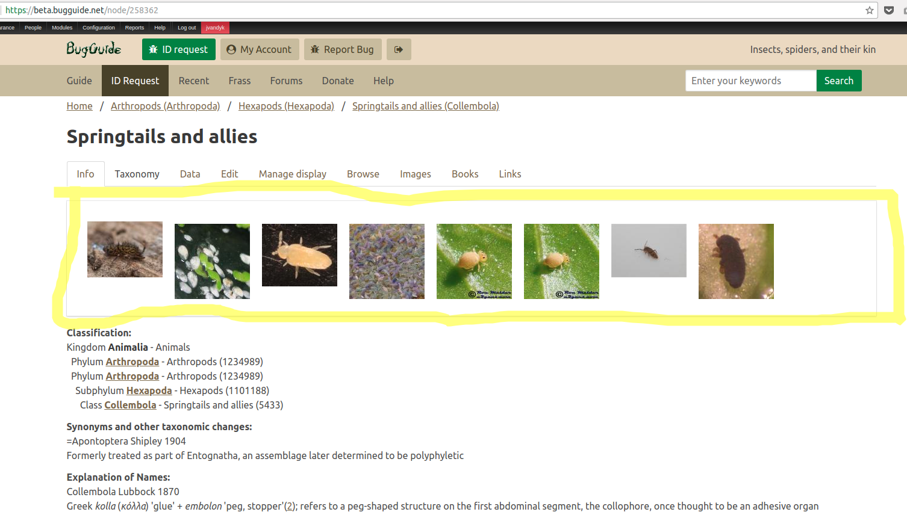
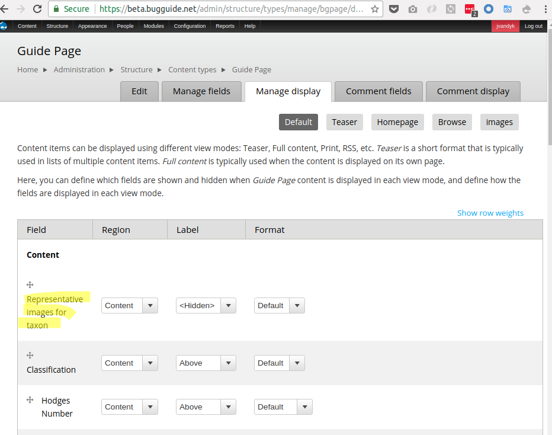
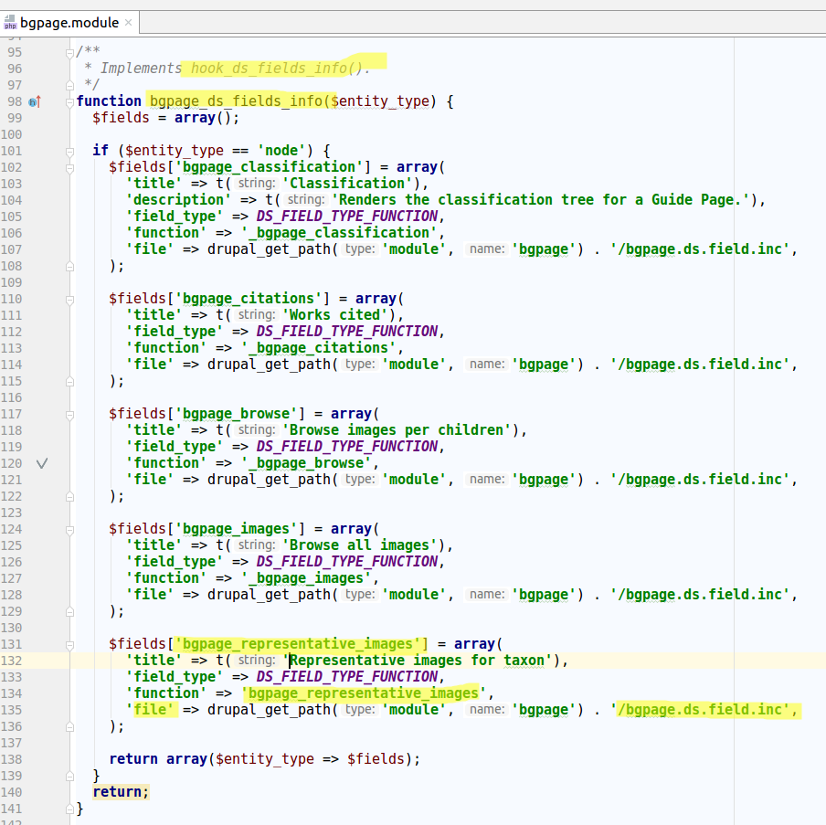
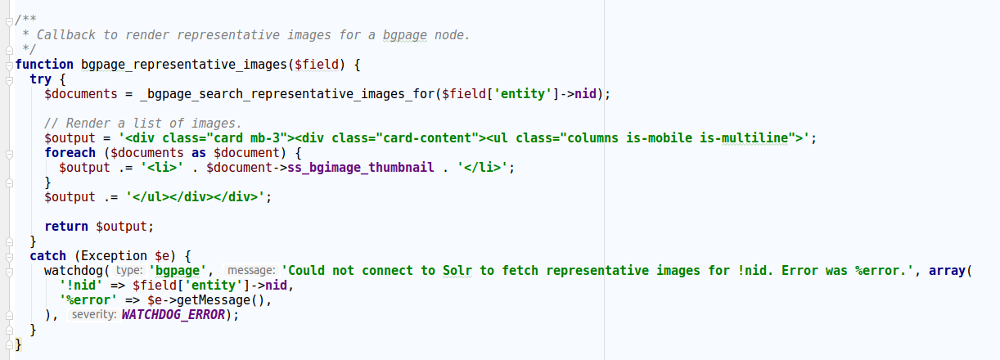

Display suite supports programmed fields to be placed in a layout. This is very useful when
you want to write custom logic to render some data in the page. Here is an example:

The list of representative images for a given taxon is calculated via a Solr query. Here is the list:

When we click con Manage Display, we can see the field at the top:

This field is defined at `hook_ds_fields_info()`. Here is the hook implementation:

And finally, here is the field callback:

