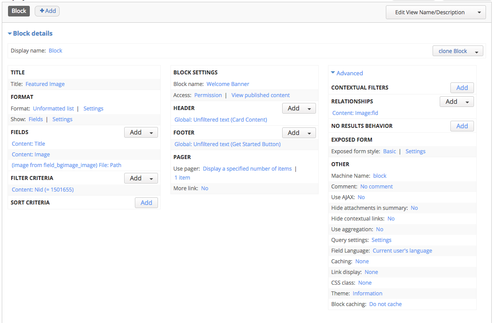

# How the Homepage is Set Up

## Page
The homepage is a basic Page (`/welcome`) set to home in Configuration > Site Information. The layout of this page uses the Page view mode Homepage.

* All fields are Disabled
* The Display Suite layout used is "One column"
* The Custom Page Title is set to "Hide"

## Custom front template
We use a custom page template in the bulmabug sub-theme because we want to hide the tabs. `page--front.tpl.php`

## Blocks
There are three Blocks on the homepage:

1. Welcome Banner
2. Recent Images
3. Visual Guide

### Welcome Banner
The welcome banner displays a welcome message, link to login, and a picture of a big pretty bug. This is created dynamically with a **View**. The HTML/CSS is built with bulma.io's Hero and Card component.

**Featured Image View**

This is a Block View based on the Image Content Type, which uses a custom template (`modules/custom/bgimage/templates/views-view--featured-image--block.tpl.php`).

* Format: Unformatted list
* Show: Fields
* Fields:
** Content: Title
** Content: Image - Formatter: Image; Image Style: None;
** (Image from field_bg_image) File: Path - Display download path instead of file storage URI

In order to have access to the file path field (which is needed so it can be used as a CSS background image on the Hero component), we must add a **Relationship** under Advanced. Content: Image:fid

The content of the Card is in the Header. The button at the bottom of the Card is in the Footer.

Pager is set to display a single item

Right now, the filter criteria draws a specific Image.

**Block Settings**

* Block title: `<none>`
* Region: Featured
* Shown only on `<front>`

### Recent Images

A row of four recently added images is display in Cards with a View, and uses the bulma.io Card component. The Recent Images View was already created, but the key is the 'Card' Display Suite layout, and the bulma.io Columns component that puts the Cards in rows.

**View: HTML list Settings**

In the View, we add bulma.io Columns component classes on "List class": `columns is-mobile is-multiline`

**Display Suite Card display**

The View shows the Display Suite option, with the Homepage view mode set. This builds the Card. So Content > Content Types > Image > Manage Display > Homepage.  The bulmabug subtheme provides the Card Display Suite layout.

* Header: Title - Label hidden, format default, wrapper `p`, class `card-header-title`
* Image: Image - Label hidden, format image, image style bg large, linked to content
* Body: Placed by - Label hidden, format default

**Block Settings**

* Region: Content
* Shown only on `<front>`

### Visual Guide

This is just a hand-made custom block in the bg module: `modules/custom/bg/templates/visual-guide.tpl.php`.

* Block settings: `bg.features.fe_block_settings.inc`
* Many more required things: `bg.module
