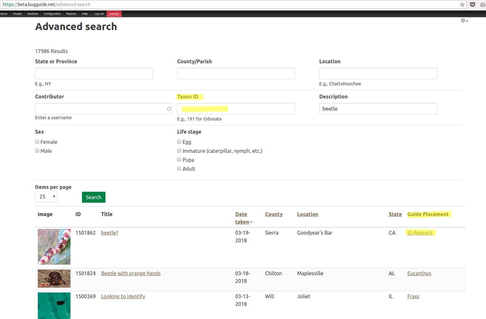

BugGuide uses views handlers to render custom fields and filters. For example, the Advanced Search page uses a custom filter to search for children images for a given taxon, plus a custom field to render a
link to the taxon that an image belongs to:



# Implementing custom Views handlers

Defining views handlers is tricky. You need to:

1 Implement hook_views_api() unless Features has done it yet. See the following
from `bgimage.features.inc`:

```
/**
 * Implements hook_views_api().
 */
function bgimage_views_api($module = NULL, $api = NULL) {
  return array("api" => "3.0");
}
```

2 At bgimage.views.inc, define the handlers and attach them to the table that contains the data
   that you need:

```
/**
 * Implements hook_views_data_alter().
 */
function bgimage_views_data_alter(&$data) {
  // Add a custom filter for searching a taxon in the tree.
  $data['field_data_field_parent']['parent_ancestor'] = array(
    'group' => 'Content',
    'title' => t('Parent ancestor'),
    'title short' => t('Parent ancestor'),
    'help' => t('Filters content that contains the given taxon in the parent tree.'),
    'real field' => 'field_parent_value',
    'filter' => array(
      'handler' => 'bgimage_handler_filter_parent',
    ),
  );

  // Add a custom field handler for rendering the immediate parent.
  $data['field_data_field_parent']['immediate_parent'] = array(
    'group' => 'Content',
    'title' => t('Immediate parent'),
    'title short' => t('Immediate parent'),
    'help' => t('Renders a link to the immediate parent.'),
    'real field' => 'field_parent_value',
    'field' => array(
      'handler' => 'bgimage_handler_immediate_parent',
    ),
  );
```

3 Create the class that will contain the handler. Here is the parent filter one:

```
<?php

/**
 * @file
 * Definition of bgimage_filter_handler_parent.
 */

/**
 * Filters content whose parent is included in the parent tree.
 */
class bgimage_handler_filter_parent extends views_handler_filter_string {

  /**
   * Executes the query.
   *
   * @TODO refactor this logic along with bgref_views_query_alter and bglink_views_query_alter.
   */
  function query() {
    $this->ensure_my_table();
    $field = "$this->table_alias.$this->real_field";

    // Load the bgpage node.
    $bgpage = node_load($this->value);
    if (empty($bgpage)) {
      return;
    }

    // Build the bgpage node's tree. Then add it as a condition.
    $parents = $bgpage->nid;
    if (!empty($bgpage->field_parent['und'][0]['value'])) {
      $parents = $bgpage->field_parent['und'][0]['value'] . ',' . $bgpage->nid;
    }

    $this->query->add_where($this->options['group'], db_or()
      ->condition($field, $parents, '=')
      ->condition($field, $parents . ',%', 'LIKE')
    );
  }

}
```

4 Add the filter to the module's info file so Drupal will load it. Like this:

```
files[] = bgimage_handler_filter_parent.inc
```

# Templates for fields and filters
In order to make the above process simpler, use the following templates:

For a custom views field handler, see [this example](https://gist.github.com/juampynr/5816530).

For a custom views filter handler, see [this example](https://gist.github.com/juampynr/27df316e7dab89f02a6d18bbff252bc2).
